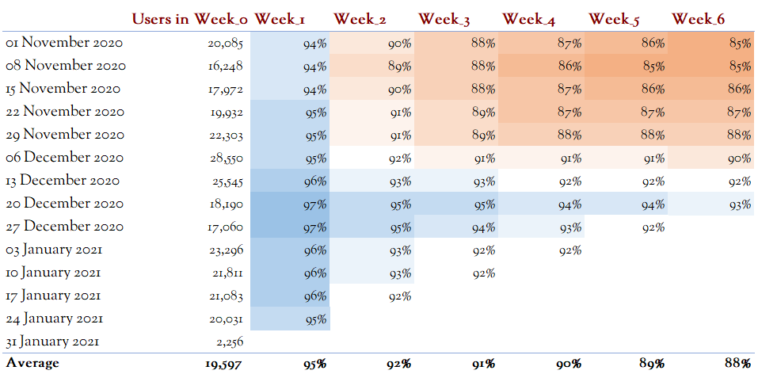
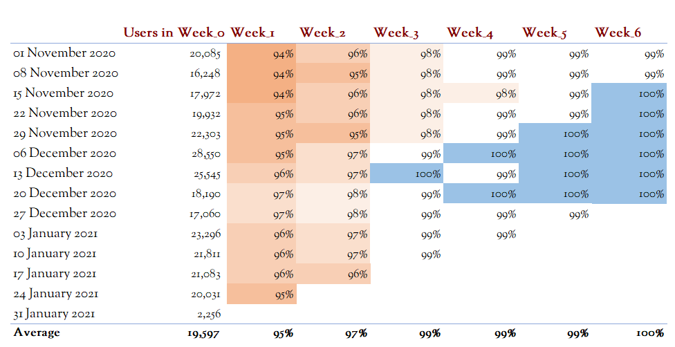

# Cohort analysis of user retention using SQL and Excel

## Overview

This project uses a cohort analysis to examine retention rates of subscribed users over a six-week period. The analysis generates weekly retention cohorts, showing how many subscribers from each weekly cohort remain active over the following six weeks. This data enables insights into customer retention patterns and helps identify factors contributing to subscription longevity.

The analysis is based on SQL queries that calculate weekly retention and churn rates, allowing for in-depth investigation into customer engagement with the subscription service.

## Project structure

1. **SQL script**:
   - The SQL script generates weekly cohorts and calculates retention by counting active users per week over a six-week period.
   - Each weekly cohort includes:
     - **Number of subscribers (Week 0)**: Initial count of users who started a subscription in that week.
     - **Retention counts for weeks 1 to 6**: Counts of subscribers who remain active in each subsequent week.
   - Additionally, churn and retention rates are calculated to assess subscriber behaviour trends.

2. **Excel dashboard**:
   - The Excel dashboard provides visualizations that offer insights into user retention patterns over time.
   - Visualizations include:
     - **Total users per cohort per week**: Displays the number of active users in each week following their subscription start.
     - **Retention rate relative to users in Week 0**: Shows the percentage of users remaining active each week relative to the initial cohort size.
     - **Retention rate relative to users in the previous week**: Highlights week-over-week retention, identifying which weeks have the highest or lowest retention rates.

## How to Use the SQL Script

1. **Define the date range**:
   - Modify the `date_range` CTE if you wish to analyze a different period.

2. **Run the main query**:
   - Use the `main` CTE to filter subscriptions data within the defined date range.
   
3. **Calculate active customers by week**:
   - The `output` CTE calculates the active subscribers per cohort for weeks 1 to 6.
   
4. **Calculate churn and retention rates**:
   - Additional CTEs provide churn rate (`churn_rate`) and retention rate metrics (`retention_rate_vs_week_0` and `retention_rate_vs_previous_week`).

## Visuals and Findings

- **Total Users per Cohort per Week**  
  
  
  *Summary*: This chart shows the number of users that remain active each week following the start of their subscription. Each cohort is grouped by the week in which users started their subscription.

- **Retention Rate Relative to Users in Week 0**  
  
  
  *Summary*: This chart displays the retention rate each week relative to the users in week 0. It highlights how user retention varies across cohorts from week to week.

- **Retention Rate Relative to Users in the Previous Week**  
  
  
  *Summary*: This table indicates the percentage of users that remain active relative to the previous week, showing retention and dropout trends over time.

## Findings

1. The largest subscriber cohorts were in early December, with above-average retention observed in early to mid-January. Smaller cohorts appeared in mid-November and late December, likely due to the holiday season.

2. November cohorts showed lower retention in week 1 and week 6 compared to later cohorts, with retention rates improving significantly by mid-December. In January, week 1 retention started to decline slightly, with a drop from 96% in mid-December to 93% by mid-January.

3. Across all cohorts, week 1 exhibited the highest churn rate, while week 6 retained at least 99% of users from the previous week. Retention was strongest in December cohorts, followed by January and November. Improving retention in weeks 1 and 2 would have the most impact on overall retention rates.

## Recommendations

1. Investigate why more users were subscribing in early December 2020 relative to January 2021 (see Table 1).
2. Determine why retention rates between week 0 and week 1 were higher in late December cohorts than in January cohorts (see Table 2).
3. Focus on strategies to improve retention rates between weeks 0 and 1 to have the largest impact on overall retention rates (see Table 3).

## Contribution Guidelines

Contributions are welcome! Please feel free to submit a pull request or raise an issue if you have any suggestions.
